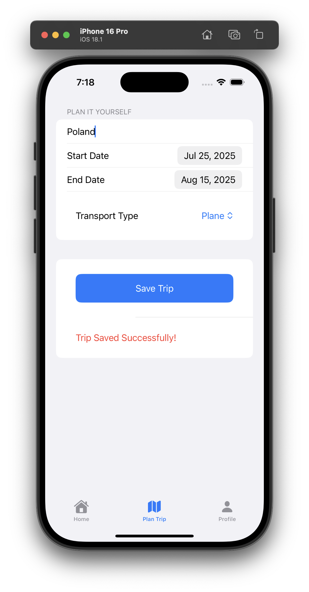

# Wanderlust Ways
## iOS Development Project for Database Systems Course

* This is an unpublished and unfinished application, with possibility of completion in the future.
* Developed in Fall of 2024
* App Icon Created with AI and Edited Afterwards

This application was developed as part of a Graduate Database Systems course. The goal of the project was to explore implementing databases through a website or an application. I chose to do an iOS application as I never had the opportunity to complete one for a class and thought it was the perfect opportunity. 

Before I started developing this application, I thought about what I wanted from a packing and prep app and what I have been missing from just using paper and pen or the Notes app. I also looked at the other applications that are available on the App Store. The apps that were available had many features that felt overwhelming like having the app track your flight status and terminal, essentially putting the airline app into the packing app. Along with the view, that there are individuals who only need to focus on what they are bringing and not on the logistics, like I do since I travel with my family and someone else is in charge. 

To store the information that the user inputs, Google Firebase Firestore was used. Information is stored in NoSQL. 
For user authentication, Google Firebase Authencation, provides password hashing for security. 

## Features
- Create and View Upcoming Trips
  - Specifying travel dates and transportation type
  - In each specific trip the user can create and view
    - Packing List
      - Adding items to a specific category
      - Having the ability to edit and check off the items
    - Itinerary
      - Adding activities with start and end time along with if it is a reservation and if you have documentation that is needed
      - The user can edit the activity and view the calender

## Screenshots

## Future Development 
There is a possiblity that I will finish/continue the development of this application and possibly publish to the App Store. The features that I would include:
- There are some components that need to be fixed
- Updated UI/UX; collapsable calender and chronological order for itinerary
- Using MapKit to geotag the locations on the itinerary 
